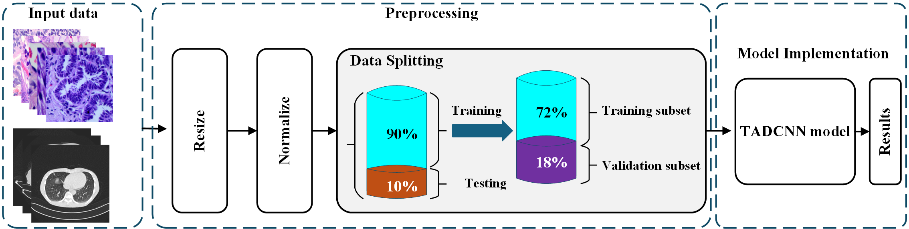

# TADCNN for Lung cancer classification 

# introduction

Chest CT scan images hold invaluable diagnostic potential in identifying various pulmonary conditions, including malignant tumors. Our project aims to streamline the classification process of these images into four distinct classes: 'adenocarcinoma', 'large cell carcinoma', 'normal', and 'squamous cell carcinoma'. In this article we have presented texture aware deep convolutional network for lung cell classification.

## Dataset

Dataset for this Project is taken from Kaggle. Here is the Dataset [Link](https://www.kaggle.com/datasets/mohamedhanyyy/chest-ctscan-images/data).

## Dataset Information

* Images are not in dcm format, the images are in jpg or png to fit the model.
* Data contain 3 chest cancer types which are Adenocarcinoma,Large cell carcinoma, Squamous cell carcinoma , and 1 folder for the normal cell.
* Data folder is the main folder that contain all the step folders inside Data folder are test , train , valid.

* test represent testing set
* train represent training set
* valid represent validation set
* training set is 72%
* testing set is 18%
* validation set is 10%
#### Dataset Details
<pre>
Dataset Name            : Chest CT-Scan images Dataset (Adenocarcinoma vs Large cell carcinoma vs Squamous cell carcinoma vs Normal)
Number of Class         : 4
Number/Size of Images   : Total      : 1000 (124 MB)
                          Training   : 720
                          Testing    : 180
                          Validation : 100 
</pre>
# Workflow of Methdology
 

All images are resized to 224×224 pixels to standardize input shape and reduce computational cost (bilinear
interpolation for RGB, area interpolation for CT slices). For LC25000, RGB values are converted to float32 and
scaled to [0, 1] via division by 255. For IQ-OTH/NCCD, images are likewise scaled to [0, 1] for consistency. After
preprocessing, the data are partitioned at the patient level into 72% training, 18% validation, and 10% test (i.e., 90%
train/val split with an 80:20 split), using stratified sampling and a fixed random seed for reproducibility. During training
we apply light augmentation (random horizontal/vertical flips and small rotations) to reduce overfitting. Fig. 3 presents
a schematic overview of the proposed methodology.

 

# Proposed Model
 

Overview of the proposed TADCNN. Left — SC-PTEM: three depthwise-separable branches with different
receptive fields extract multiscale features. Their outputs are fed to a small gating path (concat → 1×1 conv → gating
head → softmax) that produces per-pixel weights; the branches are reweighted and merged into a single fused feature
map. Middle — TAAM: two attentions run in parallel—spatial attention (avg/max over channels → 1×1 conv → sigmoid)
and channel attention (global average pooling → small MLP → sigmoid); their outputs are added to refine the features
without changing tensor size. Right — Classification head: an optional 1×1 projection, global average pooling, and a linear
layer with softmax produce class probabilities.

 

# Results
## On LC25000 Dataset
 

Comparison of TADCNN model with other deep learning models based on convergence in the accuracy while
training and testing the LC25000 dataset; (a) Train accuracy curves, (b) Test accuracy curves, (c) Train loss curves,(d)
Test loss curves

 

 

Comparison of TADCNN model with other deep learning models based on the confusion matrices for the LC25000
dataset; (a) Proposed TADCNN, (b) DenseNet121, (c) Efficient- NetV2L ,(d) Xception, (e)InceptionResNetV2, (f) VGG19,
(g) MobileNetV2, (h) ShuffleNetV2

 

 
Classification results showing actual vs predicted tissue types, with high confidence levels across different
conditions: Colon-aca, Colon-n, Lung-aca, Lung-n, and Lung-scc

 
 
Examples of predictions with varying confidence scores on challenging LC25000 patches.

 

## On IQ-OTH/NCCD Dataset

 
Comparison of TADCNN model with other deep learning models based on convergence in the accuracy while
training and testing the IQ-OTH/NCDD dataset; (a) Train accuracy curves, (b) Test accuracy curves, (c) Train loss
curves,(d) Test loss curves.

 

 
Comparison of the TADCNN model with other deep learning models based on the confusion matrices
for the IQ-OTH/NCDD dataset; (a) Proposed TADCNN, (b) DenseNet121, (c) Efficient- NetV2L ,(d) Xception,
(e)InceptionResNetV2 , (f) VGG19, (g) MobileNetV2, (h)ShuffleNetV2.

 

 
Classification results showing actual vs predicted tissue types, with high confidence levels across different
conditions: benign, Malignant, Normal.

 
