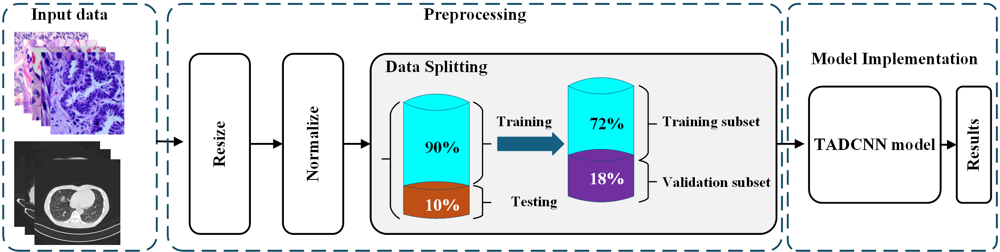
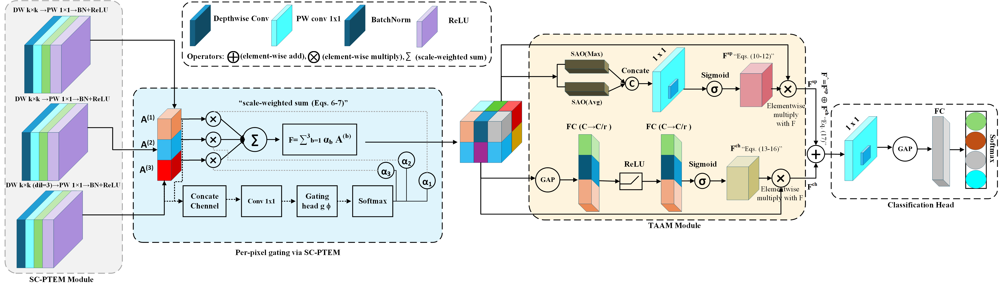

# Title
**Texture-Aware Deep Convolutional Neural Network (TADCNN) for Multi-Class Lung Cancer Classification from Chest CT Images**

---
# Description
This repository provides the official implementation of a **Texture-Aware Deep Convolutional Neural Network (TADCNN)** for automated lung cancer classification using chest CT scan images. The proposed model classifies CT images into **four clinically relevant categories**: *adenocarcinoma*, *large cell carcinoma*, *squamous cell carcinoma*, and *normal*. The framework emphasizes texture-aware feature extraction and attention-driven representation learning to improve diagnostic reliability.

---

## Dataset
The primary dataset used in this study is obtained from **Kaggle**:

**Chest CT-Scan Images Dataset (LC25000)**  
Dataset link: https://www.kaggle.com/datasets/mohamedhanyyy/chest-ctscan-images/data

### Dataset Information
- Image formats: JPG / PNG (non-DICOM)
- Number of classes: 4  
  - Adenocarcinoma  
  - Large Cell Carcinoma  
  - Squamous Cell Carcinoma  
  - Normal  
- Directory structure:
  - `train/` – Training set (60%)
  - `valid/` – Validation set (20%)
  - `test/` – Testing set (20%)

### Dataset Details


Dataset for this Project is taken from Kaggle. Here is the Dataset [Link](https://www.kaggle.com/datasets/andrewmvd/lung-and-colon-cancer-histopathological-images).

## Dataset Information

* Images are not in dcm format, the images are in jpg or png to fit the model.
* Data contain 3 chest cancer types which are Adenocarcinoma,Large cell carcinoma, Squamous cell carcinoma , and 1 folder for the normal cell.
* Data folder is the main folder that contain all the step folders inside Data folder are test , train , valid.

* test represent testing set
* train represent training set
* valid represent validation set
* training set is 72%
* testing set is 18%
* validation set is 10%

An additional dataset (**IQ-OTH/NCCD**) is used for cross-dataset generalization experiments, following the same preprocessing protocol.

---

## Code Structure
- `TADCNN-model.py`  
  Implements the complete TADCNN architecture, including:
  - Multi-scale depthwise–pointwise convolution blocks
  - Scale-aware feature fusion
  - Texture-aware attention modules
  - Classification head
  - Training, validation, and evaluation pipeline

- `requirements.txt`  
  Lists all required Python dependencies.

- `Images/`  
  Contains workflow diagrams, model architecture illustrations, and experimental result visualizations.

---

## Installation
The code is implemented in **Python 3.9.19**.

### Environment Setup
```bash
conda create -p env python=3.9 -y
conda activate ./env

## Installation
The Code is written in Python 3.9.19. If you don't have Python installed you can find it here. If you are using a lower version of Python you can upgrade using the pip package, ensuring you have the latest version of pip.
## Run Locally
```bash
conda create -p env python=3.9 -y
```
```bash
conda activate ./env
```
### Step 3 - Install the requirements
```bash
pip install -r requirements.txt
```

### Step 4 - Load dataset and Preprocessing
- The preprocessing pipeline performs:  
  
  - Image resizing to 224 × 224
  - RGB conversion
  - Intensity normalization using model-specific preprocessing
  - Label encoding and one-hot encoding
  - Stratified dataset splitting

- `All preprocessing steps are embedded within TADCNN-model.py.`  
 
---


```bash
base_dir = 'E:/datasets/LC25000'
img_size = (224, 224)

# Get class labels from subfolder names
class_labels = sorted(os.listdir(base_dir))

# Function to load and preprocess images (500 per class)
def load_images_from_dir(directory, class_labels, max_per_class=5000):
    imgs = []
    lbls = []
    
    for label in class_labels:
        class_path = os.path.join(directory, label)
        class_count = 0
        
        if os.path.isdir(class_path):
            # Get list of image files in this class
            img_files = os.listdir(class_path)
            random.shuffle(img_files)  # Shuffle to get random samples
            
            for img_file in img_files:
                if class_count >= max_per_class:
                    break
                    
                img_path = os.path.join(class_path, img_file)
                img = cv2.imread(img_path)
                
                if img is not None:
                    img = cv2.resize(img, img_size)
                    img = cv2.cvtColor(img, cv2.COLOR_BGR2RGB)
                    img = preprocess_input(img.astype(np.float32))
                    imgs.append(img)
                    lbls.append(label)
                    class_count += 1
    
    return np.array(imgs), np.array(lbls)

# Load images (500 per class)
images, labels = load_images_from_dir(base_dir, class_labels, max_per_class=5000)

# Encode labels
le = LabelEncoder()
int_labels = le.fit_transform(labels)
labels = to_categorical(int_labels, num_classes=len(class_labels))
# labels = tf.one_hot (labels, depth=len(class_labels))
print(labels.shape)

# Split data
X_train1, X_test1, y_train1, y_test1 = train_test_split(images, labels, test_size=0.1, random_state=42)
# Split data
X_train, X_test, y_train, y_test = train_test_split(X_train1, y_train1, test_size=0.18, random_state=42)
```
### Step 5 - Model Training and Evaluation
```bash
python TADCNN-model.py

```
### Reproducibility

- Fixed random seed (seed = 42) is used

- Complete training and evaluation pipeline is provided

- Dataset source and preprocessing steps are fully documented

---
### Citation

If you use this code in academic work, please cite:

- The associated PeerJ Computer Science article

- The original LC25000 Kaggle dataset
---
### License

This repository is intended for academic and research use only. Please consult the LICENSE file for usage terms.
---

### Contribution Guidelines

Contributions are welcome. Please ensure:

- Clear documentation

- Reproducible experiments

- Clean and modular code structure


If you want next, I can:
- Write a **formal PeerJ reviewer response (point-by-point)**
- Extract a **clean pseudocode / algorithm section** for the paper
- Refactor `TADCNN-model.py` for **cleaner reproducibility and modularity**


# Methdology
<br>

- The proposed workflow consists of:

- Image resizing and normalization

- Texture-aware feature extraction using multi-scale depthwise separable convolutions

- Scale-conditioned feature fusion via soft gating

- Parallel spatial and channel attention refinement

- Global feature aggregation and classification

A schematic overview of the methodology is shown in below.



</br>

## Data Preprocessing (Materials & Methods)

All images are resized to 224 × 224 pixels to standardize input dimensions and reduce computational complexity. Pixel intensities are converted to float32 and normalized to the range [0, 1]. The dataset is split at the class level into 72% training, 18% testing, and 10% validation, using a fixed random seed to ensure reproducibility. During training, light data augmentation (random flips and rotations) is applied to mitigate overfitting.
# Proposed Model
<br>

Overview of the proposed TADCNN. Left — SC-PTEM: three depthwise-separable branches with different
receptive fields extract multiscale features. Their outputs are fed to a small gating path (concat → 1×1 conv → gating
head → softmax) that produces per-pixel weights; the branches are reweighted and merged into a single fused feature
map. Middle — TAAM: two attentions run in parallel—spatial attention (avg/max over channels → 1×1 conv → sigmoid)
and channel attention (global average pooling → small MLP → sigmoid); their outputs are added to refine the features
without changing tensor size. Right — Classification head: an optional 1×1 projection, global average pooling, and a linear
layer with softmax produce class probabilities.



</br>

# Results
## On LC25000 Dataset
<br>

Comparison of TADCNN model with other deep learning models based on convergence in the accuracy while
training and testing the LC25000 dataset; (a) Train accuracy curves, (b) Test accuracy curves, (c) Train loss curves,(d)
Test loss curves


</br>

<br>

Comparison of TADCNN model with other deep learning models based on the confusion matrices for the LC25000
dataset; (a) Proposed TADCNN, (b) DenseNet121, (c) Efficient- NetV2L ,(d) Xception, (e)InceptionResNetV2, (f) VGG19,
(g) MobileNetV2, (h) ShuffleNetV2


</br>

<br>
Classification results showing actual vs predicted tissue types, with high confidence levels across different
conditions: Colon-aca, Colon-n, Lung-aca, Lung-n, and Lung-scc


</br>
<br>
Examples of predictions with varying confidence scores on challenging LC25000 patches.


</br>

## On IQ-OTH/NCCD Dataset

<br>
Comparison of TADCNN model with other deep learning models based on convergence in the accuracy while
training and testing the IQ-OTH/NCDD dataset; (a) Train accuracy curves, (b) Test accuracy curves, (c) Train loss
curves,(d) Test loss curves.


</br>

<br>
Comparison of the TADCNN model with other deep learning models based on the confusion matrices
for the IQ-OTH/NCDD dataset; (a) Proposed TADCNN, (b) DenseNet121, (c) Efficient- NetV2L ,(d) Xception,
(e)InceptionResNetV2 , (f) VGG19, (g) MobileNetV2, (h)ShuffleNetV2.


</br>

<br>
Classification results showing actual vs predicted tissue types, with high confidence levels across different
conditions: benign, Malignant, Normal.


</br>
